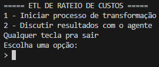

# Techlab DevOps Challenge

Bem vindo ao repositório de código do desafio Devops Techlab!

## Objetivo da aplicação

Com esse projeto, visa-se criar um script ETL para transformar e gerar informações sobre os custos de uma empresa com seus funcionários, levando em consideração todos os beneficios concedidos a estes.

[Documento de requisitos disponível no repositório](https://github.com/Erick-Bonifacio/DevOps-challenge/blob/main/assets/Desafio%20DevOps.pdf)

## Menu de opções iniciais

Ao rodar o programa, o seguinte menu é apresentado:



A partir desse menu, o usuário pode selecionar uma das opções para continuar:

1 - Iniciar processo de transformação:

Essa opção inicia o pipeline de ETL (Extração, Transformação e Carga), responsável por carregar os dados brutos, aplicar os tratamentos necessários e gerar um novo arquivo consolidado e estruturado para análise. Há a leitura dos arquivos no diretório e a chamada do modelo de IA para cada um destes a fim de adquirir as transformações desejadas depois, o script junta os arquivos tratados, calcula a somatória de custos e salva os resultados no diretório de saída.

2 - Discutir resultados com o agente:

Essa funcionalidade extra permite que o usuário interaja com um agente conversacional especializado em rateio de custos. O agente pode responder a perguntas sobre os dados, realizar cálculos como médias e totais, e ajudar a interpretar os resultados de maneira mais interativa e inteligente. O agente pode executar qualquer operação relacionada ao arquivo, mas apenas algumas operações são executadas pelo script, outras - mais complexas - são enviadas a LLM com a permissão do usuário para uma análise profunda.

Qualquer outra tecla - Sair:

Encerra a execução do programa.

## Funcionamento
[Demonstração simples da opção 1](https://github.com/Erick-Bonifacio/DevOps-challenge/blob/main/assets/system_basic_demonstration.mp4)

Arquivo main.py: Ponto de entrada do sistema -> Apresenta um menu com as opções e com base na escolha, direciona o fluxo para o controlador adequado.

### Opção 1 - Processo de transformação

Descrição: Realiza o fluxo ETL decidido pelo modelo LLM, aplica regra de rateio e salva arquivo de resultado.

Responsável: ProcessingController

Etapas:

Leitura de arquivos: Carrega os arquivos .xlsx da pasta definida em INPUT_DIR.

Geração do fluxo de transformação: Usa um agente LLM (DecisionAgent) para definir quais ferramentas devem ser aplicadas em cada arquivo, com base em uma amostra inicial dos dados.

Aplicação das transformações: Executa as funções mapeadas, como

- Renomear colunas
- Normalizar nomes
- Converter valores para moeda
- Excluir colunas

Merge de arquivos: Mescla os arquivos com base em colunas comuns (cpf, nome), tratando duplicações de nome.

Cálculo de rateio: Adiciona uma coluna com o custo total por indivíduo.

Salvamento: Exporta o resultado para a pasta OUTPUT_DIR.

### Opção 2. Discussão dos Dados (EXTRA)
Descrição: Assistente focado em responder perguntas (média, desvio padrao, agrupamentos, etc) sobre o arquivo de resultado gerado. Atua com tools pré definidas e chamadas massivas (em casos específicos)

Responsável: DiscussingController

Etapas:

Leitura de arquivos processados:
Carrega planilhas da pasta OUTPUT_DIR.

Interação com o usuário:
Permite perguntas livres. Cada pergunta é enviada ao agente (ChatSession), que decide qual função aplicar nos dados.

Funções disponíveis localmente:

- Operações estatísticas em colunas: soma, média, mediana, mínimo, máximo, desvio padrão e variância (com suporte ao formato BRL).
- Resumo estatístico completo (`describe`).
- Ordenação de dados por colunas (ascendente ou descendente).
- Agrupamentos simples e agregados por soma, média, mediana e desvio padrão.

Execução da ferramenta recomendada:
A função correspondente é aplicada aos dados e o resultado é interpretado pelo agente, que devolve uma explicação em linguagem natural. Caso não haja ferramentas locais o suficiente para a execução da tarefa pedida, o sistema pergunta ao usuário se deve enviar os dados para a análise direta da LLM.

## Como rodar (WSL/LINUX)

Deve-se ter o interpretador do Python instalado 

Clone o projeto

```bash
  git clone https://github.com/Erick-Bonifacio/DevOps-challenge.git
  cd DevOps-challenge
```

Crie e ative um ambiente virtual Python

```bash
  python -m venv venv
  source venv/bin/activate
```

Instale as bibliotecas do projeto

```bash
  pip install -r requirements.txt
```

    
Copie o arquivo .env e preencha sua GROQ_API_KEY e o diretorio de saída dos arquivos que desejar

```bash
  cp .env.exemple .env
```

[Join Groq Here](https://console.groq.com/docs/overview)


Rode o projeto

```bash
  python main.py
```

O menu demontrado aparecerá no terminal.

## Tempo de execução

O tempo de execução varia de acordo com o tamanho dos arquivos de entrada, pois operações com dataframes com a biblioteca Pandas são O(n). Deve-se considerar a latência do envio de requisições a LLM e seu tempo de processamento - que costuma ser regular, uma vez que não são enviados todos os dados para a análise.

Com os inputs atuais fornecidos, o processo de transformação leva de 60 a 90 segundos.

O tempo de tal processo é exibido ao fim da execução.

## Tratamento de erros e prevenção de falhas

O sistema pode falhar, principalmente por conta das respostas do modelo de IA. Assim, foram implementadas medidas preemptivas:

- Decision Double Check: O fluxo de transformação é gerado e, a partir da resposta da primeira chamada, uma segunda chamada de conferência acontece, visando atenuar erros comuns, como drops esquecidos, formatação não realizada e outros.
- Retentativa: O fluxo de ETL, em caso de erro, é reiniciado. O número máximo de tentativas é 3.
- Reset do chat: Para mitigar alucinações do modelo na discussão de resultados, o chat é silenciosamente resetado a cada resposta. Como o objetivo é atender a perguntas diretas do usuário sobre o arquivo de resultado, o contexo é descartado.


## Explicações e Preferências técnicas

### LLM usada

Todo o projeto usa o modelo 'deepseek-r1-distill-llama-70b' para suas operações (análise e tomada de decisão). A escolha desse modelo se dá pela alta capacidade (melhor entre os disponíveis no Groq) de raciocínio e manipulação de dados, sendo treinada com mais de 70 Bilhões de parâmetros. 

### Por que essa arquitetura?

Inicialmente, devido ao escopo reduzido do projeto, optei por não utilizar nenhum framework inicializador, mas sim criar manualmente a arquitetura conforme necessidades e seguindo padrões já sabidos.
Assim, devido as condições, não foi identificada a necessidade de algo mais complexo.

## Desafios

Diversos desafios foram encontrados e superados durante a jornada, dentre eles, destaco:

- Aprender algo novo: Trabalhar com chamadas a LLMs e lidar com seus retornos - incluindo todos os tratamentos necessário para isso - foi algo novo para mim e foi desafiador em certo ponto, estou certo que adquiri um conhecimento útil e aprimorei minhas habilidades.
- Entender e otimizar um prompt: Diminuir alucinações, entender como a LLM 'pensa' e saber como fazer um prompt eficiente foi desafiador e, confesso, estressante. Mas reconheço o quão crucial essa etapa é, e que não pode ser tratada banalmente.

## Tendências Futuras

- Uso de agents que suportem upload de arquivos: Visando maior precisão e escalabilidade.
- Integração com banco de dados: O projeto se limita ao uso de fontes .xlsx, o que demanda manutenção e troca manual periódica desses dados. Uma conexão sólida com um banco de dados volumoso pode ser benéfica para análise de mais indicadores.
- Interface melhorada: A medida em que cresce a necessidade e a quantidade de dados, uma interface web se faz necessária para melhor visualização dos dados. 
- Novas funcionalidades: As tranformações possíveis durante o fluxo foram restringidas devido ao escopo reduzido do projeto, mas novas e mais específicas operações podem ser adicionadas (Como pivot ou unpivot, por exemplo).

## Autor

- [@erick-bonifacio](https://www.github.com/erick-bonifacio)
